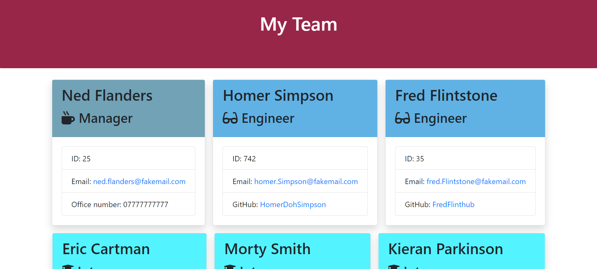

# Team Profile Generator

[](https://opensource.org/licenses/MIT)

---

## Description

This repository is for a Team profile generator. Information can be given by the user that will then be stored and used to create a HTML page displaying the inputted teams information.

This generator will ideally be used to help create a team profile page quickly and efficiently allowing a team to work on more important matters.

---

## Table of Contents

1. [Usage](#usage)
2. [License](#license)
3. [Questions](#questions)

## Usage

In order to use the Team profile generator, once the code has been downloaded input the following code to the terminal:

```
node index.js
```

This will then set the Team profile generator in motion!

The following image shows what a team profile generated HTML and CSS page will look like:



---

## License

MIT

---

## Questions

In order to reach out for questions and feedback please use the following:

Github link: [BritishCryptoGuy](https://github.com/BritishCryptoGuy)

Email adress: Kieran_parkinson@hotmail.com
